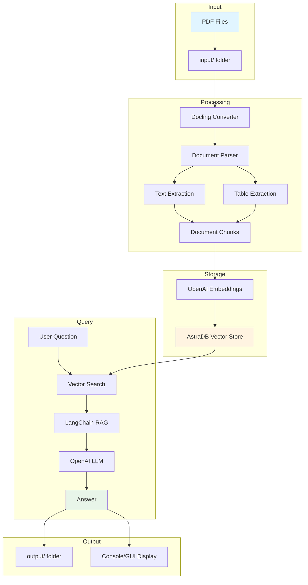
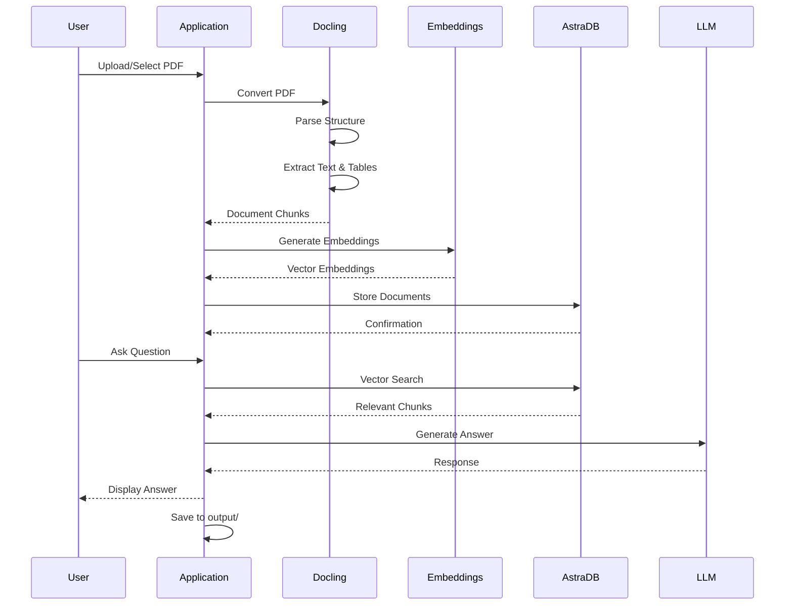

# PDF to AstraDB Vector Store with Docling

A comprehensive solution for processing PDF documents and storing them in AstraDB vector database using Docling for document parsing. This project provides both console and GUI interfaces.

## 🎯 Overview

This project replaces Unstructured-io with Docling for PDF processing and provides two applications:
1. **Console Application**: Command-line interface for batch processing
3. **Cloud Deployment**: IBM Cloud Code Engine serverless deployment

2. **GUI Application**: Streamlit-based web interface for interactive use

## 🏗️ Architecture



## 🔄 Workflow



## 📁 Project Structure

```
.
├── README.md                   # This file
├── requirements.txt            # Python dependencies
├── .env                        # Environment variables (not in git)
├── .gitignore                 # Git ignore rules
│
├── app_console_docling.py     # Console application
├── app_gui_docling.py         # Streamlit GUI application
│
├── input/                     # Input PDF files
│   └── *.pdf
│
├── output/                    # Query results (timestamped)
│   └── query_result_*.txt
│
├── scripts/                   # Utility scripts
│   ├── launch_gui.sh         # GUI launcher (detached mode)
│   └── stop_gui.sh           # GUI stopper
│
├── k8s-cloud/                 # IBM Cloud Code Engine deployment
│   ├── Dockerfile            # Container image definition
│   ├── application.yaml      # Code Engine app manifest
│   ├── secrets.yaml          # Secrets template
│   ├── configmap.yaml        # Configuration
│   ├── deploy.sh             # Deployment script
│   ├── build-local.sh        # Local build script
│   └── README.md             # Deployment guide
│
├── Docs/                      # Project documentation
│   ├── INSTALLATION.md
│   ├── CONFIGURATION.md
│   └── PROJECT_SUMMARY.md
│
└── logs/                      # Application logs (auto-created)
    └── streamlit_*.log
```

## 🚀 Getting Started

### Prerequisites

- Python 3.9 or higher
- OpenAI API key
- AstraDB account with:
  - API Endpoint
  - Application Token

### Installation

1. **Clone the repository**
   ```bash
   git clone <repository-url>
   cd UnstructuredServerless-AstraDBServerless-2-Docling
   ```

2. **Create virtual environment**
   ```bash
   python -m venv venv
   source venv/bin/activate  # On Windows: venv\Scripts\activate
   ```

3. **Install dependencies**
   ```bash
   pip install -r requirements.txt
   ```

4. **Configure environment variables**
   
   Create a `.env` file in the project root:
   ```env
   API_ENDPOINT=your_astradb_api_endpoint
   APPLICATION_TOKEN=your_astradb_token
   OPENAI_API_KEY=your_openai_api_key
   ```

5. **Add PDF files**
   
   Place your PDF files in the `input/` folder.

## 💻 Usage

### Console Application

Run the console application for batch processing:

```bash
python app_console_docling.py
```

**Features:**
- Automatic PDF detection from `input/` folder
- Processes first PDF found
- Displays sample content
- Runs predefined queries
- Shows results in console

### GUI Application

#### Option 1: Direct Launch
```bash
streamlit run app_gui_docling.py
```

#### Option 2: Detached Mode (Recommended)
```bash
./scripts/launch_gui.sh
```

Or with custom port:
```bash
./scripts/launch_gui.sh 8502
```

**Features:**
- Web-based interface
- PDF file selection
- Real-time processing log
- Interactive query interface
- Example questions
- Results saved to `output/` folder
- Timestamped output files

**Access the GUI:**
- Local: http://localhost:8501
- Network: http://your-hostname:8501

**Stop the GUI:**
```bash
kill $(cat logs/streamlit.pid)

### Cloud Deployment (IBM Cloud Code Engine)

Deploy the GUI application to IBM Cloud Code Engine for serverless, auto-scaling deployment:

```bash
# Set environment variables
export ASTRADB_API_ENDPOINT="your-endpoint"
export ASTRADB_TOKEN="your-token"
export OPENAI_API_KEY="your-key"

# Run deployment script
cd k8s-cloud
./deploy.sh
```

**Features:**
- Serverless deployment (scale to zero)
- Auto-scaling based on demand
- Built-in HTTPS and load balancing
- Container-based deployment
- Cost-effective (pay per use)

**See [k8s-cloud/README.md](k8s-cloud/README.md) for detailed deployment instructions.**

```

## 🔧 Configuration

### AstraDB Setup

1. Create a database at [AstraDB](https://astra.datastax.com)
2. Generate an application token
3. Copy the API endpoint
4. Add credentials to `.env` file

### OpenAI Setup

1. Get API key from [OpenAI Platform](https://platform.openai.com)
2. Add to `.env` file

## 📊 Features Comparison

| Feature             | Console App | GUI App   | Cloud Deployment |
|---------------------|-------------|-----------|------------------|
| PDF Processing      | ✅          | ✅        | ✅              |
| Docling Integration | ✅          | ✅        | ✅               |
| AstraDB Storage     | ✅          | ✅        | ✅               |
| Interactive Queries | ❌          | ✅        | ✅               |
| File Selection      | Auto        | Manual    | Manual           |
| Processing Log      | Console     | Web UI     | Web UI          |
| Output Files        | ❌          | ✅         | ✅              |
| Example Questions   | Predefined  | Interactive| Interactive     |
| Detached Mode       | N/A         | ✅         | ✅              |
| Auto-Scaling        | N/A         | ❌         | ✅              |
| Scale to Zero       | N/A         | ❌         | ✅              |
| HTTPS/SSL           | N/A         | Manual     | ✅              |
| Load Balancing      | N/A         | Manual     | ✅              |

## 🔍 How It Works

### 1. PDF Processing with Docling

Docling converts PDF files into structured documents:
- Extracts text content
- Identifies tables and converts to HTML
- Preserves document structure
- Handles headers, footers, titles

### 2. Document Chunking

Documents are split into logical chunks:
- New chunk on title elements
- Tables stored separately
- Headers/footers filtered out
- Metadata preserved

### 3. Vector Storage

Documents are embedded and stored:
- OpenAI embeddings (text-embedding-ada-002)
- Stored in AstraDB vector collection
- Enables semantic search

### 4. Query Processing

Questions are answered using RAG:
- Vector similarity search
- Retrieves relevant chunks
- LLM generates answer from context
- Only uses provided context

## 📝 Example Queries

The applications include example queries for testing:

1. "What does reducing the attention key size do?"
2. "For the transformer to English constituency results, what was the 'WSJ 23 F1' value for 'Dyer et al. (2016) (5]'?"
3. "When was George Washington born?" (tests knowledge boundaries)

## 🛠️ Troubleshooting

### Common Issues

**Import errors:**
```bash
pip install -r requirements.txt --upgrade
```

**AstraDB connection issues:**
- Verify API endpoint and token in `.env`
- Check network connectivity
- Ensure database is active

**PDF processing errors:**
- Verify PDF is not corrupted
- Check file permissions
- Ensure sufficient disk space

**GUI not accessible:**
- Check if port is already in use
- Verify firewall settings
- Try different port: `./scripts/launch_gui.sh 8502`

## 📚 Documentation

Additional documentation is available in the `Docs/` folder:
- API reference
- Configuration guide
- Deployment instructions

## 🔗 References

- [Docling Documentation](https://github.com/docling-project/docling)
- [AstraDB Python Client](https://docs.datastax.com/en/astra-db-serverless/api-reference/dataapiclient.html)
- [LangChain Documentation](https://python.langchain.com/)
- [Streamlit Documentation](https://docs.streamlit.io/)

## 📄 License

This project is provided as-is for educational and development purposes.

## 🤝 Contributing

Contributions are welcome! Please follow these guidelines:
1. Test functionality before submitting
2. Update documentation for changes
3. Follow existing code style
4. Update README if needed

## 📧 Support

For issues and questions:
- Check the troubleshooting section
- Review the documentation
- Check application logs in `logs/` folder

---

**Built with ❤️ using Docling, Streamlit, and AstraDB**